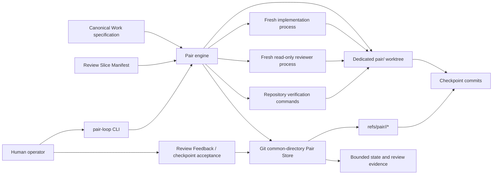
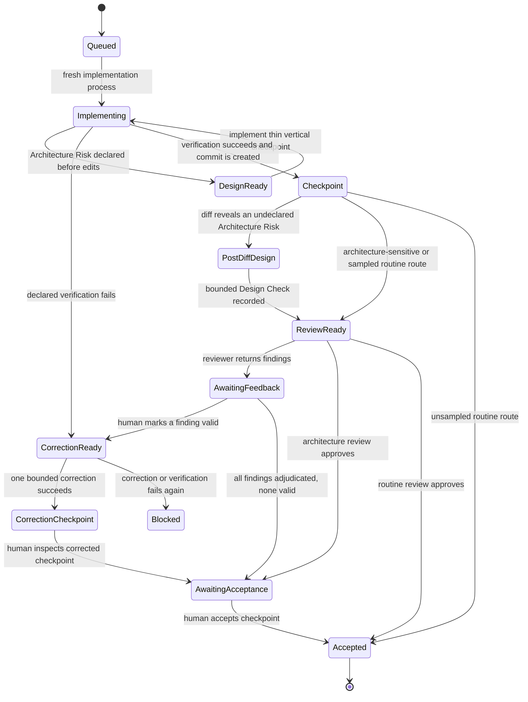
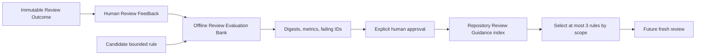

# Pair vNext Architecture

- **Work ID:** `work-20260803-pair-evidence-at-commit`
- **Runtime name:** Pair Evidence-at-Commit
- **Status:** implemented architecture
- **Primary stack:** Node.js orchestration for .NET, TypeScript, and React repositories

## Purpose

Pair vNext replaces the artifact-heavy Pair v3/v4 pipeline with a small control plane around immutable Git checkpoints. The canonical specification owns intent; a minimal Review Slice Manifest orders delivery; current code and runtime evidence—not a speculative implementation-design document—determine architecture and review decisions.

The system optimizes for three outcomes:

1. expose architecture while a code change is still small;
2. prevent low-confidence review findings from causing autonomous churn;
3. keep every model input, model output, and durable state projection bounded.

The approved [specification](spec.md) is the intent authority. The [Pair v4 skill](../../../skills/pair-v4/SKILL.md) is the operator runbook. This document describes the implemented runtime structure and its current limits.

## System context



Pair is a local orchestration layer. It does not run inside the product and introduces no product runtime dependency.

## Component responsibilities

| Component | Responsibility | Must not own |
|---|---|---|
| `pair-cli` | Parse commands and render bounded status/evaluation summaries | Workflow policy or model history |
| `pair-engine` | Advance one persisted lifecycle transition, dispatch providers, verify, checkpoint, route, and pause | Provider conversation continuity |
| `review-slice-manifest` | Validate ordered Review Slices and Acceptance Criteria coverage | Design decisions, source excerpts, or tests inventories |
| `architecture-routing` | Normalize a declared Architecture Risk and inspect a checkpoint diff for risk signals | A closed list of all possible architecture concerns |
| `provider-runtime` | Start a fresh Codex or Claude process with a strict output schema and stripped nested-session identity | Retry loops, transcript persistence, or workflow state |
| `pair-worktree` | Create/remove the isolated worktree and lazily hydrate JavaScript dependencies or named submodules | Pair lifecycle state |
| `pair-store` | Atomic bounded files, audit events, Git blobs, and `refs/pair/*` reachability | Product-branch files |
| `review-evidence` | Validate immutable finding anchors and record Review Outcomes/Feedback | Finding acceptance authority |
| `review-evaluation` | Run the offline Review Evaluation Bank and retain aggregate results | Runtime review prompts |
| `review-guidance` | Propose, approve, retain, scope, and select compact reviewer rules | Raw review history or automatic policy activation |

The CLI depends inward on the engine. The engine composes the other modules. Storage, provider, worktree, and review modules do not call back into CLI behavior.

## State and evidence ownership

Canonical local Pair data lives under the repository's Git common directory, so it survives deletion of a linked worktree. Each checkout also has a small locator in its own Git directory:

```text
<git-dir>/pair-current.json           # checkout-local Work locator

<git-common-dir>/
├── pair/
│   ├── review-guidance.json          # repository-wide approved guidance index
│   └── works/<work-id>/
│       ├── spec.md
│       ├── review-slices.json
│       ├── state.json                # lifecycle projection consumed by the engine
│       ├── events.jsonl              # append-only bounded audit records
│       ├── design-checks/<slice>.md
│       ├── review-outcomes/<id>.json
│       ├── review-feedback.jsonl
│       ├── evaluations/<digest>.json
│       └── dependency-cache/<fingerprint>/
└── refs/pair/<work-id>/
    ├── base
    ├── head
    ├── completed
    ├── checkpoints/<slice-id>
    ├── reviews/<review-outcome-id>
    └── feedback/<review-feedback-id>
```

`state.json` is the current lifecycle projection used by the engine. `events.jsonl` is an audit trail of small references and deltas; the current implementation does not replay it to reconstruct a missing state file. Git refs keep checkpoint commits and immutable evidence blobs reachable, but local Pair history is intentionally lost when the repository clone is deleted.

Accepted slices retain only identifiers, route, correction count, and base/checkpoint commits. Changed paths are reconstructed from the immutable commit range when composition analysis needs them. Invocation history is reduced to cumulative totals plus the latest three summaries.

## Review Slice lifecycle

Each `pair-loop run` performs at most one model action. Deterministic verification may run in the same transition.



The engine commits only after the declared verification command succeeds. Architecture-sensitive changes require fresh model review and explicit human acceptance. Routine changes may be accepted from deterministic proof or selected for deterministic sampling.

At Work completion, Pair reruns every distinct manifest verification command. It performs a combined-diff review only when accepted slices changed overlapping paths. The current implementation does not yet detect every cross-file semantic interaction, rebase resolution, or deployment interaction at this gate.

## Architecture routing

Routing has two inputs:

1. the implementer's open-ended, one-sentence Architecture Risk; and
2. a deterministic post-commit diff inspection used as a backstop.

Any declared or observed risk selects the Architecture-Sensitive Path. No risk selects the Routine Path. The signal is deliberately not a finite enum: an unknown runtime responsibility must be expressed in the risk sentence rather than forced into a predefined category.

The current diff backstop recognizes representative risks in the user's primary stacks:

- **.NET:** service lifetimes, singleton/static state, middleware order, endpoint/public contracts, hosted services and background jobs, `HttpClient`, transactions, retries, authorization, and concurrency primitives;
- **TypeScript/Node:** exported contracts, process/global state, workers, timers, queues, eventing, `fetch`/Axios, promises and ordering, retries, and security boundaries;
- **React:** Context, reducers, Redux/Zustand/MobX, browser storage, and state ownership;
- **distributed deployment:** Kubernetes/Helm/deployment changes, replicas, probes, ingress/load balancers, affinity, multi-pod behavior, brokers, and remote boundaries.

Regex inspection is a conservative backstop, not an architecture oracle. It may miss a semantic responsibility change expressed without a recognized syntax. Correct routing still depends on the fresh implementer reading the seam, callers, contracts, and deployment context and declaring uncertainty as risk.

An Architecture-Sensitive Path records a sub-2-KiB Design Check with six concerns: seam/callers, ownership/state/lifetime, runtime/failure/deployment, contract/compatibility, rejected alternative, and proof. The first checkpoint should be one thin path from production entrypoint through the changed boundary to its first real usage.

## Failure Proof and verification

A completed Review Slice returns one Failure Proof naming:

- the real failure boundary;
- the proof method (`base-reproduction`, `unit`, `integration`, `contract`, `e2e`, `runtime`, or `manual`);
- a negative control, mutation, base failure, or equivalent observation.

Pair validates the structure, runs the exact manifest verification command, records only status/duration/digests, and rejects a failed command. It does not persist verification logs in Pair state.

The current runtime validates that the negative-control statement exists; it does not independently prove that the control or mutation was executed. Repositories should encode critical negative controls in deterministic tests or verification commands until runtime-observed proof capture is added.

## Review evidence and human authority

A reviewer is a fresh, read-only provider process. It receives the checkpoint range, mapped Acceptance Criteria, verification summary, applicable Design Check, Architecture Risk, and at most three approved Review Guidance rules. It does not receive prior transcript or raw Review Outcome history.

Approval is `{ "verdict": "approve", "findings": [] }`. A blocking result contains at most three `BLOCKER` or `MAJOR` findings. Each finding must state a falsifiable claim, reachable scenario, impact, pass condition, and immutable evidence anchor.

The anchor is stable across future source edits:

```text
checkpoint commit + repository path -> verified Git blob + line range
```

When later commits move or replace those lines, the stored commit still resolves the original path to the original blob. Review is therefore about the exact code observed, not whichever content later occupies the same working-tree line numbers.

A model finding is only an evidence proposal. Pair cannot dispatch a finding-driven correction until a human records `valid`. `false-positive`, `not-worth-fixing`, and `missing-context` preserve calibration evidence without changing code. One accepted finding may authorize one fresh correction; another failure blocks for human control.

## Review learning



Raw findings and human comments do not accumulate in future prompts. The evaluation compares baseline and candidate precision, retained-defect detection, escapes, token use, duration, attempts, and human rework across 20–50 fixture-referenced cases. Only an improving, explicitly approved proposal becomes active.

The repository index retains at most 16 active rules. A review receives only the latest three whose scope matches its route. Rejected, superseded, or irrelevant history costs disk and offline processing, not model input tokens.

## Worktree and dependency model

Pair creates `pair/<work-id>` in `.pair-worktrees/<work-id>` by default. Product changes and checkpoints live on that branch; Pair infrastructure files remain in the Git common directory and do not enter the product branch.

- JavaScript package-manager caches are keyed by manager, lockfiles, Node major version, platform, and architecture.
- A mutable `node_modules` directory is never shared directly. Pair tries copy-on-write cloning and otherwise uses the package manager's native cache.
- Only explicitly named Git submodules are initialized.
- Pair has no .NET-specific hydration layer. `dotnet restore` uses the normal global NuGet package cache, while worktree-local `obj`/`bin` outputs may be recreated.
- Worktree removal refuses uncommitted files and removes only the checkout. The branch, Pair Store, checkpoint refs, and evidence remain.

Pair never merges automatically. After completion, the human reviews and merges or cherry-picks `pair/<work-id>` from the primary worktree, then removes the linked worktree.

## Enforced data budgets

| Surface | Limit | Durable? | Future model input? |
|---|---:|---|---|
| Review Slice Manifest | 16 KiB, 1–40 slices | yes | only current slice projection |
| Implementation result JSON | 2 KiB | no; deleted after ingestion | current transition only |
| Design Check | under 2 KiB | yes | applicable checkpoint only |
| Reviewer result JSON | 6 KiB | no; normalized after ingestion | current transition only |
| Review Outcome | 8 KiB | yes | never wholesale |
| Review Feedback row | 2 KiB | yes, append-only | never wholesale |
| Pair event row | 4 KiB | yes, append-only | never |
| `state.json` | 16 KiB | yes | status projection, not prompt history |
| Review Evaluation Bank | 32 KiB | yes/offline | never in runtime review |
| Review Evaluation result | 16 KiB | yes | normalized proposal metrics only |
| Review Guidance index | 32 KiB, 16 active rules | yes | maximum 3 selected rules |

The append-only JSONL files can grow over the lifetime of a repository, but they are never injected into model prompts. Their growth is a local storage/inspection concern, not a per-review token multiplier.

## Failure boundaries

- Oversized or schema-invalid provider output fails before lifecycle acceptance.
- A provider process receives no prior provider session identity and cannot resume a previous Pair invocation.
- A Design Check request fails if the provider edited the worktree before approval.
- A finding fails validation if `commit:path` does not resolve to its declared blob or its line range is invalid.
- A deterministic failure permits one correction; repeated failure blocks.
- Unadjudicated findings and architecture-sensitive approval pause for a human.
- Atomic files and per-Work locks protect bounded state writes; Git refs protect evidence reachability.
- Dirty worktrees cannot be removed.
- Deleting the repository clone deletes local Pair history by design.

## Current architectural limitations

1. **Semantic routing remains partly model-dependent.** Diff patterns cannot discover every ownership, API, state, or distributed-systems change.
2. **Failure Proof execution is indirect.** Pair verifies the declared command but does not independently execute or observe every stated negative control.
3. **Completion composition detection is path-overlap based.** Cross-file semantic coupling can require human review even when accepted slices touched different files.
4. **`state.json` is not rebuilt from events.** Events are bounded audit evidence, not a reducer log in the current implementation.
5. **Review evaluation fixtures are operator-maintained.** Pair evaluates and gates guidance but does not automatically decide which historical cases deserve promotion into the bank.
6. **Evidence is local.** Pair refs and the common-directory store are not pushed or backed up automatically.

These are explicit extension seams. Improvements should strengthen deterministic observation at these boundaries without reintroducing large planning artifacts, raw review-history prompts, warm provider sessions, or autonomous review-fix loops.

## Code map

- CLI: `skills/pair-v3/scripts/pair-cli`
- Workflow engine: `skills/pair-v3/scripts/lib/pair-engine.js`
- Git common-directory store: `skills/pair-v3/scripts/lib/pair-store.js`
- Worktree hydration: `skills/pair-v3/scripts/lib/pair-worktree.js`
- Fresh provider adapter: `skills/pair-v3/scripts/lib/provider-runtime.js`
- Architecture routing: `skills/pair-v3/scripts/lib/architecture-routing.js`
- Review evidence: `skills/pair-v3/scripts/lib/review-evidence.js`
- Review learning: `skills/pair-v3/scripts/lib/review-evaluation.js`, `skills/pair-v3/scripts/lib/review-guidance.js`
- Provider schemas: `skills/pair-v3/schemas/slice-result.json`, `skills/pair-v3/schemas/precision-review-result.json`
- Contract tests: `skills/pair-v3/tests/pair-vnext-*.test.js`
